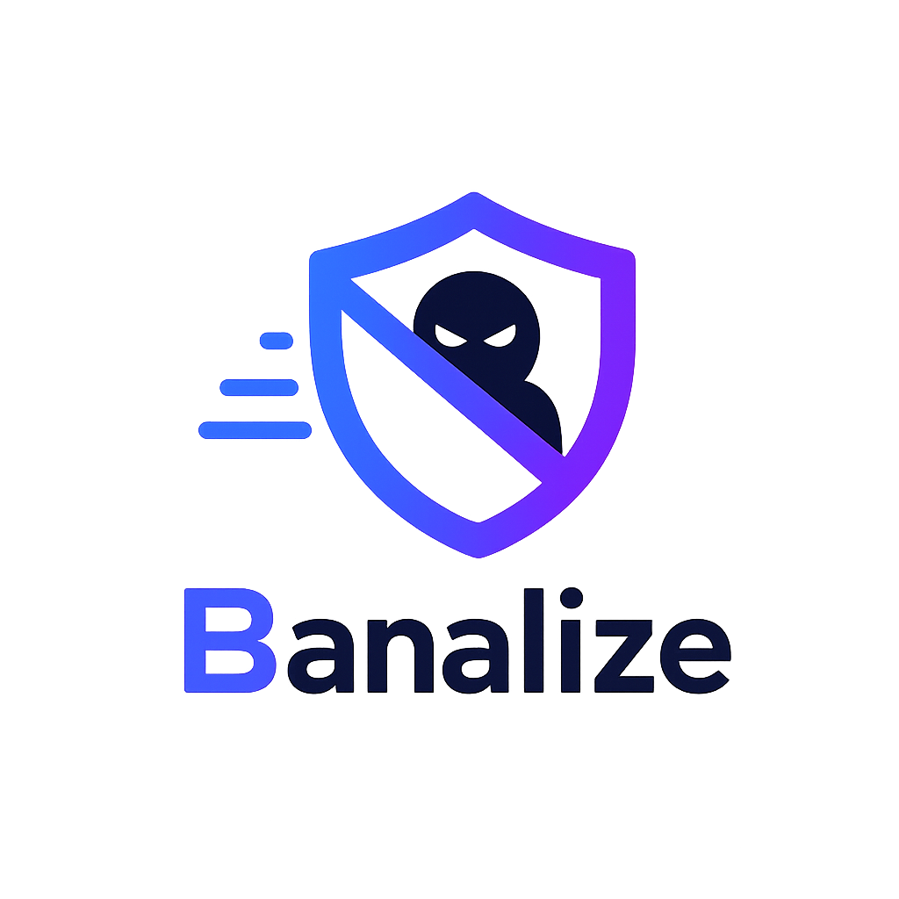

<div align="center">



**A lightweight intrusion prevention system written in Rust.**

[](https://github.com/aussedatlo/banalize/actions/workflows/pull-request.yml)
[](LICENSE.md)
[](https://www.rust-lang.org/)
[](https://react.dev/)
[](https://www.typescriptlang.org/)
[](https://www.docker.com/)

</div>

---

Banalize tails log files, extracts IP addresses via configurable regex patterns, and blocks offenders using `iptables` after a configurable number of matches within a time window.

## Architecture

```
apps/
  core/   — Rust binary  API + iptables integration   →  :6040
  ui/     — Vite + React dashboard (shadcn/ui)         →  :6041 (docker) / :5173 (dev)
```

## How it works

```
log file → regex match → IP extracted → threshold reached → iptables DROP rule
                                                          → auto-expires after ban_time
```

- **Watchers** tail one log file per config using inotify
- **Matches** are counted in an in-memory store (per config + IP) for fast threshold checks, rebuilt from the SQLite audit log on restart
- **Bans** are applied synchronously via iptables and persisted across restarts
- **Events** (match, ban, unban) are recorded asynchronously in SQLite for auditing
- **Cleaner** runs periodically to expire bans and matches outside their time windows
- **REST API** on port 6040 — documented at `GET /api/openapi.json`, UI at `GET /swagger`
- **Dashboard** at `http://localhost:6041` (docker) or `http://localhost:5173` (dev) — manage configs, view bans and matches

---

## Running with Docker

The recommended way. Requires `NET_ADMIN` and `NET_RAW` capabilities for iptables.

```sh
docker compose up -d
```

Logs:

```sh
docker compose logs -f core
```

> The container runs with `network_mode: host` so iptables rules affect the host network stack.

---

## Running locally

```sh
# Terminal 1 — API server (requires root or CAP_NET_ADMIN for real iptables)
cd apps/core && pnpm start

# Terminal 2 — Dashboard
cd apps/ui && pnpm dev
# → http://localhost:5173  (proxies /api/* to :6040)
```

---

## Configuration

Configs are created at runtime via the REST API or the dashboard. Each config defines one log file to watch and the rules for banning.

**Example — block SSH brute-force:**

```sh
curl -X POST http://localhost:6040/api/configs \
  -H 'Content-Type: application/json' \
  -d '{
    "id": "ssh-brute",
    "name": "SSH Brute Force",
    "param": "/var/log/auth.log",
    "regex": "Failed password for .* from <IP>",
    "ban_time": 3600000,
    "find_time": 60000,
    "max_matches": 5,
    "ignore_ips": ["192.168.1.0/24", "10.0.0.1"]
  }'
```

| Field         | Description                                              |
| ------------- | -------------------------------------------------------- |
| `id`          | Unique identifier                                        |
| `name`        | Human-readable label                                     |
| `param`       | Absolute path to the log file to watch                   |
| `regex`       | Pattern with `<IP>` as placeholder for the IPv4 address  |
| `ban_time`    | How long a ban lasts, in milliseconds                    |
| `find_time`   | Time window for counting matches, in milliseconds        |
| `max_matches` | Number of matches within `find_time` that triggers a ban |
| `ignore_ips`  | List of IPs or CIDR ranges to never ban                  |

---

## REST API

All endpoints return JSON. Full spec at `GET /api/openapi.json`, interactive UI at `GET /swagger`.

| Method   | Path                       | Description                            |
| -------- | -------------------------- | -------------------------------------- |
| `GET`    | `/api/configs`             | List all configs                       |
| `POST`   | `/api/configs`             | Create a config                        |
| `GET`    | `/api/configs/{id}`        | Get a config                           |
| `PUT`    | `/api/configs/{id}`        | Update a config (restarts its watcher) |
| `DELETE` | `/api/configs/{id}`        | Delete a config                        |
| `GET`    | `/api/matches`             | All match events                       |
| `GET`    | `/api/matches/{config_id}` | Match events for one config            |
| `GET`    | `/api/bans`                | All ban events                         |
| `GET`    | `/api/bans/{config_id}`    | Ban events for one config              |
| `POST`   | `/api/bans/{id}/disable`   | Manually unban an IP                   |
| `GET`    | `/api/unbans`              | All unban events                       |
| `GET`    | `/api/unbans/{config_id}`  | Unban events for one config            |

---

## Environment variables (`apps/core`)

| Variable                         | Default              | Description                                               |
| -------------------------------- | -------------------- | --------------------------------------------------------- |
| `BANALIZE_CORE_API_ADDR`         | `0.0.0.0:6040`       | HTTP listen address                                       |
| `BANALIZE_CORE_DATABASE_PATH`    | `/tmp/banalize-core` | Directory for the SQLite databases and GeoIP data         |
| `BANALIZE_CORE_FIREWALL_CHAIN`   | `INPUT`              | iptables chain to link the `banalize` chain into          |
| `BANALIZE_CORE_LOG_LEVEL`        | `INFO`               | Log verbosity (`ERROR`, `WARN`, `INFO`, `DEBUG`, `TRACE`) |
| `BANALIZE_CORE_CLEANER_INTERVAL` | `30`                 | How often the expiry cleaner runs, in seconds             |

## Environment variables (`apps/ui`)

| Variable              | Default                 | Description                                    |
| --------------------- | ----------------------- | ---------------------------------------------- |
| `BANALIZE_UI_PORT`    | `6041`                  | Port the dashboard (`vite preview`) listens on |
| `BANALIZE_UI_API_URL` | `http://localhost:6040` | Core API the dashboard proxies `/api/*` to     |

> With `docker compose`, set `BANALIZE_CORE_PORT` / `BANALIZE_UI_PORT` (e.g. in a `.env` file) to change the ports — the compose file feeds the core port into the UI's proxy target automatically.

---

## Development

Requires Rust (stable) and Node.js ≥ 18 + pnpm.

```sh
# Install JS dependencies
pnpm install

# Build everything
pnpm build

# Run core API (requires iptables / root or CAP_NET_ADMIN)
pnpm core start

# Run UI dev server
pnpm ui dev

# E2e tests for core (no iptables needed — uses a fake binary)
cargo test --test e2e

# Coverage report
cd apps/core && pnpm test:cov
# open apps/core/coverage/html/index.html
```

### Build the Docker image

```sh
docker compose build
```

---

## License

MIT — see `LICENSE.md`.
